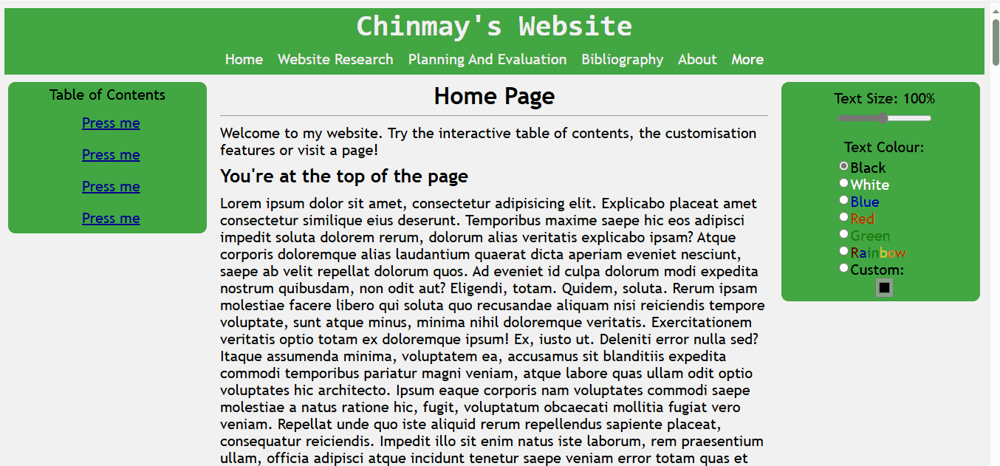

Ethics
---
The intention of using colour and layout theory is to guide the user through the webpage; for example, certain layouts encourage users to select elements for advertising purposes. However, this can be used maliciously. Dark patterns involve the designing of a user interface to manipulate users into performing certain actions such as buying insurance with their purchase or signing up for recurring bills. They are employed by websites frequently; one example is the ‘close’ button on a Microsoft update popup triggering an immediate software update (Hannah, 2022).
Dark patterns are destructive for any webpage that is intended to be visited multiple times.  While they can make a user do what the website wants them to do, which is useful in the short term, they can also make a user’s experience negative, they can damage the reputation of a brand and they are, in some US states, illegal. 
To avoid the use of dark patterns, (as they can be used unintentionally), a UI should be transparent. The language and elements in a web page should be neutral and straightforward; it should help the user in making informed decisions, perform whatever action is expected when interacted with (Hannah, 2022). This will be important in future tasks; the UIs developed until now have been simple, but as more functionality is added, effort will be required to ensure the final product is simple and free of dark patterns.
___
Artificial intelligence is another tool used in User Interface Development, and is one that is rapidly growing. However, AI can be used to do the manipulation mentioned above. As mentioned in (Acharya, Sahu and Dixit, 2024), trust in AI is increasing; this trust can be exploited. This is due to AI using data from humans; if provided the data to do so, it is capable of using dark patterns and other immoral methods in its user interfaces. Thus, to ensure this will not happen, any Artificial Intelligence needs to be programmed to prioritise empathy and human well-being over attention-seeking or profit-driven motives. 
___
Additionally, accessibility issues need to be addressed when developing user interfaces. Certain disabilities can prevent a webpage from being usable; a web page should be simple enough to minimise this inconvenience as much as possible. Research was done into certain disabilities, and how a UI can assist a user with that disability. For example, text and background should be contrasting to ensure colour-blindness will not interfere with a disabled user’s understanding of content (also a web design theory researched). Additionally, people with varying levels of eyesight should be able to use the site. The final assessment included text and size customizability options specifically for those purposes: 

Web Pages also need to be usable on different devices; certain users may only have a phone to access an user interface, in which case the site should adapt to suit their needs. This ensures the UI is accessible to a wide range of users, regardless of the device they use to access it. All user interfaces in future should have the ability to adapt to different screen sizes; in HTML, this can be done by setting the width properties of elements to percentages instead of pixels. This was implemented in the assessment submission with moderate success:

Understanding the ethics of UI development will ensure that, when developing a UI in the future with the skills gained from understanding [design](/UI%20Design%20And%20Layout/UIDesignAndLayout.md) and [technology](/Technologies/Html%20Knowledge.md) theories, the interfaces will be as user-friendly and ethical as possible. 