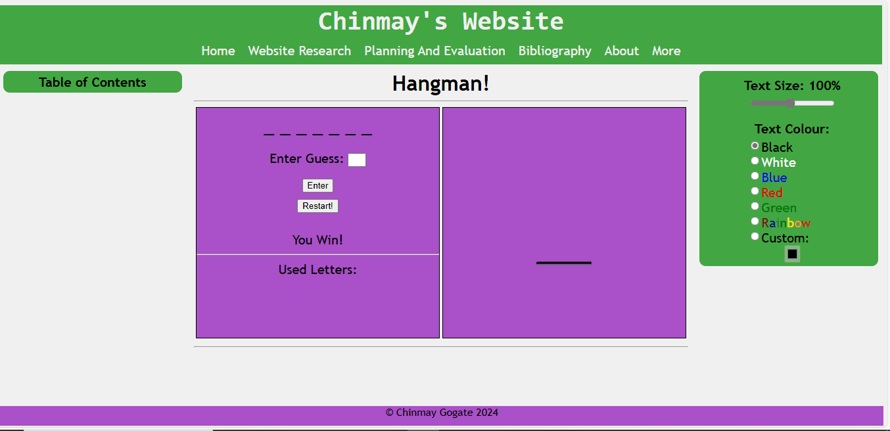

Technologies
---
As the focus of the latest assignment was on developing a HTML webpage, the weeks leading up to it were focussed on developing knowledge of the technologies. 

Week 1 was dedicated to learning HTML, a markup language used to create web pages. ‘Week1.html’ was developed using the various tags and properties in HTML that were learnt this week.
CSS was learnt in Week 2. CSS, or Cascading Style Sheets, is used to add styles and colour to a HTML webpage. This was added to ‘week1.html’ to develop ‘week2.html’. This webpage has a better layout (as the first is similar to a Word document, while this has whitespace). It also includes more components: it uses divs, to structure the webpage and make styling those different sections easy by applying a class to them. It also uses the style tag to hold the necessary CSS, making the website more appealing and easy to style (as all classes or groups of elements can be styled at once instead of individually). 

The final assessment submission includes more elements, such as fixed positions (a property of CSS that allows elements to remain on a screen while being scrolled):

,

Javascript (a programming language used to add interactivity to a webpage), shown by the hangman game coded in javascript:

,

And CSS property manipulation, using a combination of javascript (to access individual elements) and css (to apply new properties to the elements):

This shows how, during the development of the assessment piece, more features were learnt and implemented to develop a more engaging and interesting website. 
___
Any application involving user interactivity will need a front-end, as mentioned above. Using HTML/CSS for this front-end purpose has numerous advantages: 
 - HTML is lightweight and fast to load. 
 - Storage of big files is allowed because of the application cache feature.
 - Do not get to purchase any extra software because it’s by default in every window.
 - It integrates easily with other languages such as JavaScript, CSS etc. This means any back-end language used in future can be implemented with HTML. 
 - HTML allows the utilisation of templates, reducing the time required to style the webpage.
 - It is fast to download as the text is compressible.
 - HTML can be supported to each and every browser, if not supported by all the browsers. This increases user convenience,  - as the webpage will work regardless of the browser they use
 - HTML is built on almost every website, if not all websites.
 - HTML is increasingly used for data storage like XML syntax.
 (GeeksforGeeks, 2020)

Thus, if HTML is decided to be used for a front-end purpose, the skills gained will be beneficial. 
___
Additional study into Javascript was done after the basics were learnt. More advanced skills were learnt, in particular the basics of Object Oriented Programming; these will be beneficial for future projects requiring higher-level programming, such as complex apps or games. The knowledge gained from learning OOP was implemented into the program shown in file ‘jsDemonstration.html’, showing the use of classes and inheritance. 

