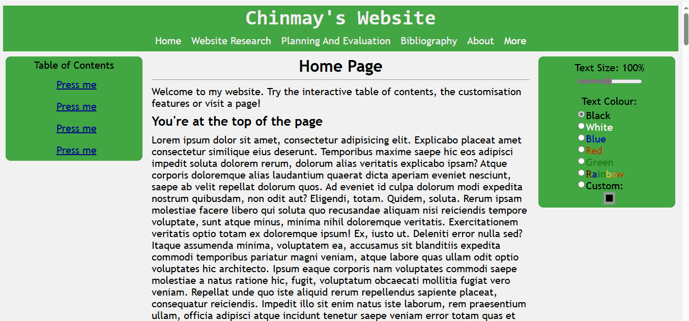
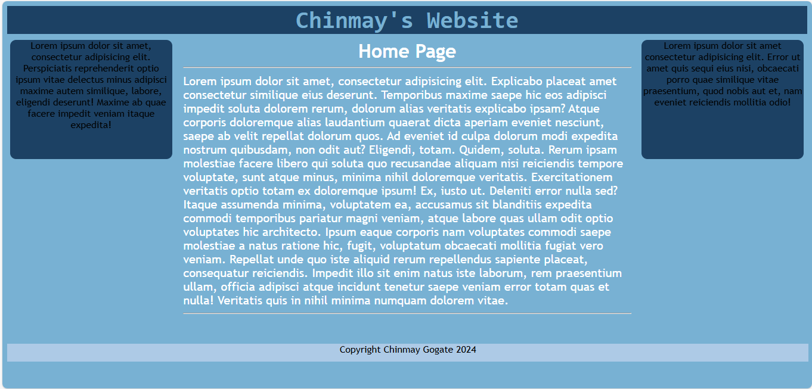
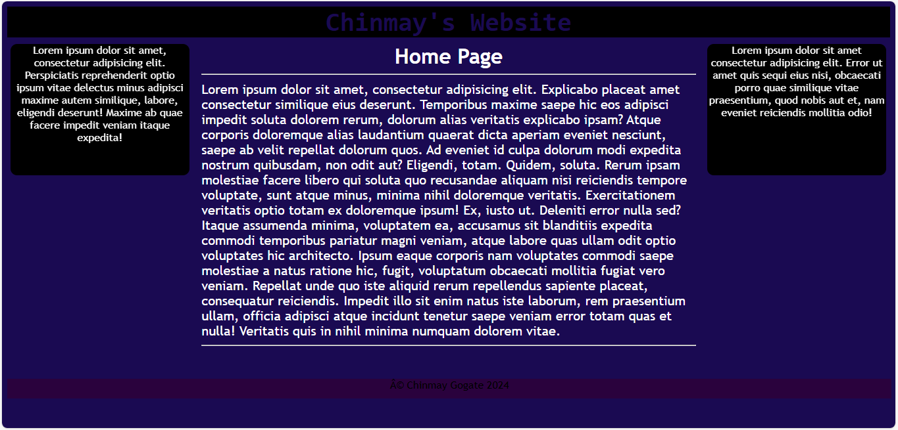

UI Design And Layout
---
The main focus of Term 3 was HTML and the development of a webpage. However, this was supported by assessment items from the previous term; notably, the PySimpleGui tasks. The feedback from these assessment pieces contributed to the decisions made in the HTML assessment. 

For example, note the specific feedback, given on the PySimpleGui assessments, shown below: 

- "The white text on black can be a bit hard to read clearly at small fonts, so be careful with that"
- "You could also bump the font size up a bit in general, as there’s a lot of screen real estate you’re not using"

These pieces of feedback were about readability, instead of layout or features; something I was not good at doing well. Thus, they were taken into consideration during the development of the HTML webpage; the grey background on black text and the size/colour customizability options were added in response to those comments:

The final assessment piece feedback mentioned the webpage was “easy to navigate and read through”; this proves the implemented features were effective, and the feedback was used well. 
Thus, this criticism allowed for the improvement of a personal weakness, ensuring it will not affect future assessments. 
___
Another area of weakness that was improved on this term was colour scheme selection. Feedback on previously designed web pages, experimental layouts for the assessment piece and usability tests for previous assessment all included disdain for the colour choice selected: 

- The format is an awful color
- It doesn’t look the best (referring to colour scheme)

Thus, throughout the HTML assessment, various colour schemes were experimented with. The process of selecting the correct colour scheme involved research into colour theory and design. For example, any web page should have a primary colour (60% of webpage, such as background), a secondary colour (30% of webpage, as element colour) and an accent colour (10% of webpage). This is why the colour scheme was chosen to be white, green and purple. Alternative colour schemes are shown below:

___
More focus should have been placed on formatting aspects of each individual element in the website. 

- “The table of contents on the left could be tidied a little, possibly by making the links the same style as the hyperlinks at the top”
- “The cards in your website research section are good, but I believe you should probably have formatted the text in them a little cleaner, something about them feels cluttered”.

All constructive criticism predominantly focused on the text contained in elements throughout the page; this was not prioritised during development, as the overall layout was deemed more important. Thus, future assignments will prioritise the setup of content inside elements. However, it is worth noting that the elements of the webpage were customisable due to the website being largely text-based and flexible; there was choice for the contents of the elements. In future, information such as data (graphs and tables) may not be so customisable.
___
UIs are what allow humans to interact with a device's underlying code (Juviler, 2022). In future, any software involving user interactions, such as one using flask or any other data science software as a back-end, will need a front-end to be designed, otherwise it will not be not useful to a user. The research and experimentation done in this course will ensure any UIs developed in future will be more user-friendly, with a more appealing colour scheme and layout. This knowledge, when paired with the skills gained from , will ensure the development of good UIs in the future.